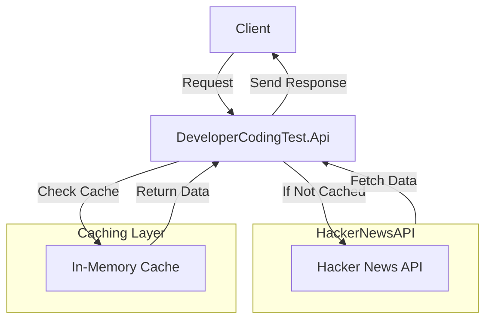

Hacker News Best Stories API

📌 Introduction

This project implements a RESTful API using ASP.NET Core (.NET 8) to retrieve the top n "best stories" from the Hacker News API. The stories are sorted by score in descending order and returned in a structured JSON format.

The API is designed for efficient request handling, incorporating in-memory caching to reduce external API calls and improve performance while ensuring fresh data availability.

🚀 Running the Application

Prerequisites

.NET SDK (NET 8)

Steps to Run (from your prefered terminal)

* ``` git clone https://github.com/johanngoSHC/DeveloperCodingTest.git```
* ``` cd .\src\DeveloperCodingTest.Api\```
*  ``` dotnet run```

 Finally
* Access the API UI Scalar at [https://localhost:7130/scalar/v1](https://localhost:7130/scalar/v1) or the API ednpoint will be accessible at:

[https://localhost:7130/api/stories/best?n=300](https://localhost:7130/api/stories/best?n=300)

🚀 Features

Retrieve top `n` best stories sorted by score.

Fetch data from Hacker News API.

In-memory caching for performance optimization.

Efficient handling of API requests to minimize external dependencies.

Implements Rate Limiting, Exponential Backoff and Circuit Breaker for API resilience.

📡 API Endpoints

Get Best Stories

GET /api/stories/best?n={value}

Response Example
```
[
  {
    "title": "A uBlock Origin update was rejected from the Chrome Web Store",
    "uri": "https://github.com/uBlockOrigin/uBlock-issues/issues/745",
    "postedBy": "ismaildonmez",
    "time": "2019-10-12T13:43:01+00:00",
    "score": 1716,
    "commentCount": 572
  },
  { ... }
]
```
🔍 Functional Requirements

| Requirement               | Description                                                        |
|---------------------------|--------------------------------------------------------------------|
| Retrieve Best Stories     | Fetch the first n "best stories" from Hacker News                  |
| Sort by Score             | Sort the stories in descending order based on score               |
| Return JSON Response      | Provide structured output with relevant fields                    |
| Efficient Request Handling| Reduce API calls using caching and concurrency optimizations      |
| API Resilience            | Rate Limiting, Exponential Backoff and Circuit Breaker    |


📌 Non-Functional Requirements

Category | Details
---------|--------
Performance | Average external API response time: 300ms
Scalability | Designed for handling multiple requests efficiently
Caching Strategy | Time-based in-memory caching to reduce API calls
Error Handling | Graceful handling of timeouts and failures|


🔄 Efficient API Request Handling

* To optimize performance and minimize unnecessary external API calls, the system follows these principles:

* In-Memory Caching: Before making a request to Hacker News, the API checks if the requested stories are cached.

* Time-Based Cache Expiry: Ensures that cached data remains fresh without excessive API calls.

* Concurrent API Calls: Fetching operations are concurrent to improve response times(Concurrency level is I/O-Bound).

* Minimized External Dependencies: No additional infrastructure such as API Gateway is used; clients directly call our API.

* Rate Limiting & Throttling: Controls API request frequency to avoid overwhelming the external API and maintain performance.

* Circuit Breaker Pattern: Detects failures and temporarily halts external requests if the Hacker News API is unresponsive, reducing excessive retries.

📌 Scope & Boundaries

✅ Included:

* Fetching top n best stories from Hacker News

* Sorting by score in descending order

* Efficient handling of API requests using caching

* Interaction between clients(http client, postman) and server (DeveloperCodingAPI) is Request - Response there for Messaging approach is out of the scope

🚫 Excluded:

* No database persistence (all data comes from Hacker News API)

* No authentication is needed

* No API Gateway or Load Balancer

🔧 Assumptions & Constraints

Category | Details
---------|--------
Assumption | Hacker News API will not change in the foreseeable future
Assumption | The fetched data from Hacker API does not change very often, therefore we can set our API rate limits very low (as secuencial request will return same information)
Assumption | The top best stories IDs are refreshed on average every 10 minutes
Constraint | The API is designed for local deployment only
Constraint | No load balancer or gateway infrastructure for now
Constraint | No mecanism to identidy when score of a story changes, this means we need to fetch story details every time requested to sort them and rank them. We will leverage cache to restrict the amount of request to Hacker Api

📐 High-Level Design

* System Components

* Client: Calls our API directly.

* Our API: Resolves from in-memory cache or fetches data from Hacker News API.

* Caching Layer: Uses time-based expiration.

* Hacker News API: External data source.

Flow Diagram




🏗️ Technology Stack

Component | Technology
---------|------------
Backend | ASP.NET Core (NET 8)
HTTP Client | HttpClientFactory
Caching | In-Memory Cache
Concurrency | Async/Await, ConcurrentForeach
Resilience | Exponential Backoff, Rate Limiting, Circuit Breaker|


🛠️ Enhancements & Future Work

* Introduce distributed caching (Redis) for scalability.
* Implement background jobs for periodic updates to cache.
* Increment Code Coverage
* In Addition I added TODO comments where I think refactors can happen:<br>
<html>
  <body>
    <ul>
      <li>
        <i class="i0"></i>
        <span>&lt;src&gt;</span>
      </li>
      <ul>
        <li>
          <i class="i1"></i>
          <span>&lt;DeveloperCodingTest.Api&gt;</span>
        </li>
        <ul>
          <li>
            <i class="i2"></i>
            <span>Program.cs</span>
          </li>
          <ul>
            <li>
              <i class="i3"></i>
              <span class="t0">TODO</span>
              <span class="t1">: The solution can be reworked into minimal api for simplicity and remove bulky code</span>
            </li>
          </ul>
          <ul>
            <li>
              <i class="i3"></i>
              <span class="t0">TODO</span>
              <span class="t1">: Rate limiting can be implemented directly on API Gateway at infrastructure level</span>
            </li>
          </ul>
          <ul>
            <li>
              <i class="i3"></i>
              <span class="t0">TODO</span>
              <span class="t1">: For some production API is not recommendable to expose this. For the purpose of this test we expose it</span>
            </li>
          </ul>
        </ul>
      </ul>
      <ul>
        <li>
          <i class="i1"></i>
          <span>&lt;DeveloperCodingTest.Core&gt;</span>
        </li>
        <ul>
          <li>
            <i class="i4"></i>
            <span>Helpers</span>
          </li>
          <ul>
            <li>
              <i class="i2"></i>
              <span>SortEngineHelper.cs</span>
            </li>
            <ul>
              <li>
                <i class="i3"></i>
                <span class="t0">TODO</span>
                <span class="t1">: Current implementation is enough for sorting small data collections. For higher inputs would recommend a merge sort implementation</span>
              </li>
            </ul>
          </ul>
        </ul>
        <ul>
          <li>
            <i class="i4"></i>
            <span>Queries</span>
          </li>
          <ul>
            <li>
              <i class="i2"></i>
              <span>GetBestStoriesQuery.cs</span>
            </li>
            <ul>
              <li>
                <i class="i3"></i>
                <span class="t0">TODO</span>
                <span class="t1">: Cache service can be reworked to use an instance of Redis</span>
              </li>
            </ul>
            <ul>
              <li>
                <i class="i3"></i>
                <span class="t0">TODO</span>
                <span class="t1">: Logger can be integrated with Serilog and be published to a cloud bucket</span>
              </li>
            </ul>
          </ul>
        </ul>
      </ul>
    </ul>
  </body>
</html>


